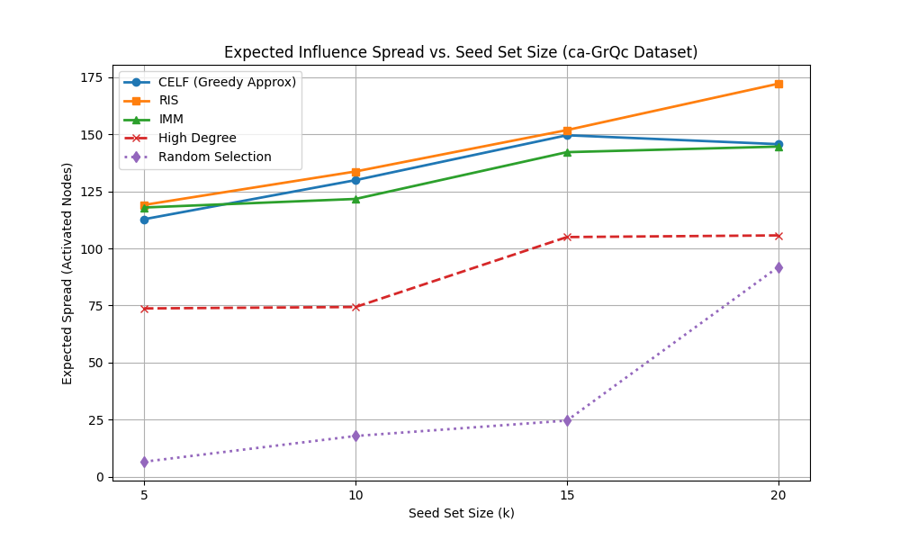

# Influence Maximization

A Python implementation and benchmarking framework for **Influence Maximization (IM)** algorithms on social networks. This project compares multiple seeding strategies to find the most influential nodes in a graph using the Independent Cascade model.

---

## Why Influence Maximization?

Influence Maximization is a fundamental problem in social network analysis with applications in:
- **Viral marketing** — finding key users to promote products
- **Information diffusion** — news spreading, awareness campaigns
- **Epidemic modeling** — containing the spread of disease

This project explores scalable algorithms to solve IM efficiently on real-world graphs.

---

## Project Structure

```
influence-maximization/
├── benchmark.py             # Benchmarking runner — compares all algorithms
├── celf_algo.py             # CELF (Cost-Effective Lazy Forward) algorithm
├── greedy_algo.py           # Greedy hill-climbing algorithm
├── heuristics.py            # Degree & other heuristic-based methods
├── imm_algo.py              # IMM (Influence Maximization via Martingales)
├── ris_algo.py              # RIS (Reverse Influence Sampling) algorithm
├── rr_helpers.py            # Helper utilities for Reverse Reachable sets
├── simulator.py             # Monte Carlo influence spread simulator
├── ca-GrQc.txt              # Dataset: CA-GrQc collaboration network (Stanford SNAP)
└── im_benchmark_results.png # Benchmark output chart
```

---

## Algorithms Implemented

| Algorithm | Description |
|-----------|-------------|
| **Greedy** | Classic hill-climbing with Monte Carlo simulation; optimal but slow |
| **CELF** | Lazy-forward optimization of Greedy; significantly faster |
| **RIS** | Reverse Influence Sampling; scalable near-optimal approximation |
| **IMM** | Influence Maximization via Martingales; theoretically grounded RIS variant |
| **Heuristics** | Fast degree/centrality-based methods for baseline comparison |

---

## Complexity Comparison

| Algorithm | Time Complexity | Notes |
|-----------|----------------|-------|
| Greedy | O(k · n · mc) | Very slow but optimal |
| CELF | ~O(n log n + k · mc) | Optimized Greedy |
| RIS | O((k + l)(n + m) log n / ε²) | Scalable |
| IMM | Similar to RIS | Theoretical guarantees |
| Heuristics | O(n log n) | Fast but naive |

---

## Dataset

The project uses the **CA-GrQc** (General Relativity and Quantum Cosmology) collaboration network from the [Stanford SNAP](https://snap.stanford.edu/data/ca-GrQc.html) dataset.

- **Nodes:** 5,242  
- **Edges:** 14,496  
- **Type:** Undirected collaboration graph

---

## Getting Started

### Prerequisites

- Python 3.9+
- No external dependencies required (uses Python standard library)

### Installation

```bash
git clone https://github.com/Samyak0204/influence-maximization.git
cd influence-maximization
```

### Run Benchmarks

```bash
python benchmark.py
```

This will run all algorithms on the dataset and generate a comparison chart saved as `im_benchmark_results.png`.

### Run Individual Algorithms

```python
from simulator import simulate
from celf_algo import celf
from imm_algo import imm

# Example: find top-10 seed nodes using CELF
seeds = celf(graph, k=10, p=0.1, mc=1000)
spread = simulate(graph, seeds, p=0.1, mc=10000)
print(f"Estimated spread: {spread}")
```

---

## Parameters

| Parameter | Description |
|-----------|-------------|
| `k` | Number of seed nodes to select |
| `p` | Propagation probability (edge activation probability) |
| `mc` | Number of Monte Carlo simulations for spread estimation |

---

## Results

The following chart compares influence spread vs runtime for different algorithms on the CA-GrQc dataset:



---

## Key Insights

- **Greedy** achieves the highest spread but is computationally expensive — impractical for large graphs.
- **CELF** provides ~3–10x speedup over Greedy with minimal loss in spread quality.
- **RIS and IMM** scale well to large graphs while maintaining near-optimal performance.
- **Heuristic** methods are the fastest but significantly less accurate than simulation-based approaches.

---

## Future Work

- Parallelize Monte Carlo simulations for faster benchmarking
- Implement community detection (Louvain)
- Modify RIS to enforce community balancing

---

## References

- Kempe, D., Kleinberg, J., & Tardos, É. (2003). *Maximizing the spread of influence through a social network.* KDD.
- Leskovec, J., Krause, A., Guestrin, C., et al. (2007). *Cost-effective outbreak detection in networks.* KDD.
- Wei Chen, Yajun Wang, and Siyu Yang (2009). *Efficient Influence Maximization in Social Networks.* KDD.
- Borgs, C., Brautbar, M., Chayes, J., & Lucier, B. (2014). *Maximizing social influence in nearly optimal time.* SODA
- Tang, Y., Xiao, X., & Shi, Y. (2015). *Influence Maximization in Near-Linear Time: A Martingale Approach.* SIGMOD.